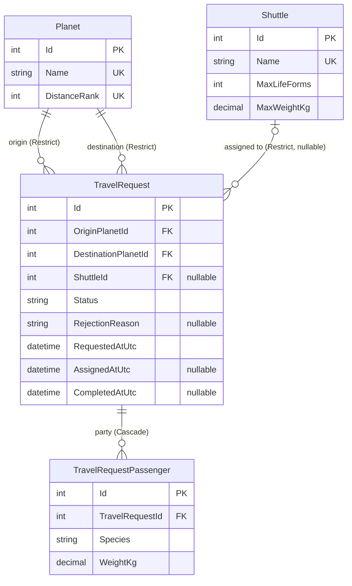

# Backend Implementation Specification — OVO Space Frontend Coding Challenge

**Source documents:** [`architecture-options.md`](architecture-options.md) §1
(Option A — Modular Monolith, recommended and adopted),
[`brd-analysis.md`](brd-analysis.md), [`nfr-analysis.md`](nfr-analysis.md)
**Purpose of this document:** turn the adopted architecture into a concrete,
buildable backend spec — C# entity classes, EF Core mapping, migrations, seed
data, full API contracts (request/response records, validation, error
responses), and the auth posture — detailed enough to implement directly with
no further design decisions required.

**Conventions used below:** items marked **[Spec decision — not in source
docs]** are choices made while writing this spec, filling gaps the BRD/NFR/
architecture docs left open; they are called out explicitly rather than
presented as quoted requirements, matching the assumption-labeling style
already used in `brd-analysis.md` §7. Everything else is a direct
formalization of a rule, edge case, or architectural decision already
recorded in the three source documents, cited inline.

---

## 0. Purpose & Scope

This spec covers the **backend only** (matches the stack scoping in
[`architecture-options.md`](architecture-options.md), opening note) and
implements **Option A — Modular Monolith** exactly as recommended in
[`architecture-options.md` §5](architecture-options.md). It is scoped to:

- Entity/domain model (§2)
- Persistence: EF Core mapping, migrations, seed data (§3)
- REST API + SignalR hub contracts, validation, and error responses (§4)
- Authentication/authorization posture (§5)

It does not cover frontend implementation, CI/CD pipeline details, or the
Dockerfile contents beyond what §3.3's connection-string convention requires
— those remain as scoped in `architecture-options.md` §1.6.

---

## 1. Solution & Project Structure

Reuses the module layout from
[`architecture-options.md` §1.2](architecture-options.md) verbatim, with one
addition (`SpaceAcademy.Infrastructure`, needed to host the shared
`DbContext` — see §3.1):

```
SpaceAcademy.sln
├── src/
│   ├── SpaceAcademy.Api/                # ASP.NET Core host: Minimal API endpoint
│   │                                       groups, SignalR hub, DI composition root
│   ├── SpaceAcademy.Infrastructure/      # SpaceAcademyDbContext, migrations,
│   │                                       DbSeeder — the only project that
│   │                                       references SQLite/EF Core provider
│   │                                       packages directly [Spec decision]
│   ├── SpaceAcademy.Modules.Fleet/       # Shuttle catalog entity, FleetStateStore
│   │                                       (in-memory), ShuttleStatus, shuttle
│   │                                       state machine
│   ├── SpaceAcademy.Modules.Dispatch/    # Dispatch algorithm, atomic
│   │                                       check-and-reserve, FIFO queue
│   ├── SpaceAcademy.Modules.Planets/     # Planet entity/catalog
│   ├── SpaceAcademy.Modules.History/     # TravelRequest/TravelRequestPassenger,
│   │                                       history + stats queries
│   ├── SpaceAcademy.Shared.Contracts/    # Cross-module DTOs/events
│   └── SpaceAcademy.Web/                 # Frontend (out of scope here)
├── tests/
│   ├── SpaceAcademy.Modules.Dispatch.Tests/
│   └── SpaceAcademy.Modules.Fleet.Tests/
└── docker-compose.yml
```

Each domain module (`Fleet`, `Planets`, `History`) owns its own entity
classes and `IEntityTypeConfiguration<T>` classes; `Infrastructure` composes
them into one `DbContext` (§3.1). This keeps "module owns its entity" while
centralizing migrations, matching the modular-monolith framing in
[`architecture-options.md` §1.1](architecture-options.md).

---

## 2. Entity Definitions

### 2.1 Enums and Value Objects

```csharp
namespace SpaceAcademy.Modules.Fleet;

public enum ShuttleStatus
{
    Idle = 0,
    EnRoute = 1,
    Arrived = 2,
}
```
Matches the 3-state shuttle machine exactly as confirmed in
[`brd-analysis.md` §3a](brd-analysis.md) — no 4th state; a loaded vs. empty
leg is an attribute of `EnRoute`, not a separate status (see §2.3).

```csharp
namespace SpaceAcademy.Modules.History;

public enum TravelRequestStatus
{
    Queued = 0,
    Assigned = 1,
    EnRoute = 2,
    Completed = 3,
    Rejected = 4,
}
```
**[Spec decision]** `Assigned` and `EnRoute` are given precise,
non-overlapping meanings beyond what `architecture-options.md` §1.3's schema
sketch states: **`Assigned`** = a shuttle has been atomically reserved for
this request and is on the *empty leg* toward the origin planet (if it
wasn't already there); **`EnRoute`** = passengers have boarded and the
shuttle is on the *loaded leg* toward the destination. This maps the
two-leg dispatch model in [`brd-analysis.md` §3a](brd-analysis.md)'s
transition table onto the request's own status field, so a client can tell
"reserved, shuttle still inbound" from "underway with your party aboard"
without an extra field.

```csharp
namespace SpaceAcademy.Modules.Dispatch;

/// <summary>
/// Domain value object for a single life form's weight. Used only in
/// domain/validation logic (capacity math, FluentValidation validators) —
/// deliberately NOT mapped into EF Core (see §2.7).
/// </summary>
public readonly struct Weight
{
    public decimal Kilograms { get; }

    private Weight(decimal kilograms) => Kilograms = kilograms;

    public static Weight FromKilograms(decimal kilograms)
    {
        if (kilograms <= 0)
            throw new ArgumentOutOfRangeException(nameof(kilograms),
                "Weight must be a positive number of kilograms.");
        if (kilograms > ShuttleCapacityConstants.MaxWeightKg)
            throw new ArgumentOutOfRangeException(nameof(kilograms),
                $"A single life form's weight cannot exceed the maximum " +
                $"shuttle capacity of {ShuttleCapacityConstants.MaxWeightKg}kg.");
        return new Weight(kilograms);
    }

    public static implicit operator decimal(Weight weight) => weight.Kilograms;
}

public static class ShuttleCapacityConstants
{
    public const int MaxLifeForms = 20;
    public const decimal MaxWeightKg = 4000m;
}
```
The upper bound in `Weight.FromKilograms` directly implements Edge Case #2
(brd-analysis.md §6 row 2: a single life form's weight alone exceeding
4000kg is rejected fast, since no shuttle could ever serve it).

**Species is a free-text `string`, not an enum** — see rationale in §2.7.

**No `PlanetCode` enum** — `Planet` identity is `Id` + unique `Name` +
unique `DistanceRank`; see rationale in §2.7.

### 2.2 Planet

```csharp
namespace SpaceAcademy.Modules.Planets;

public class Planet
{
    public int Id { get; set; }

    /// <summary>Unique. Seeded with "Angel 1", "Boreth", "Aurelia",
    /// "Blue Horizon", "Argus X" — see §3.4. Configurable/extensible per
    /// Business Rule 2 (brd-analysis.md §5.2).</summary>
    public string Name { get; set; } = default!;

    /// <summary>Unique. 1 = nearest ("Angel 1") ... 5 = farthest ("Argus X").
    /// Ordinal only — the BRD gives no numeric distance
    /// (brd-analysis.md §3).</summary>
    public int DistanceRank { get; set; }

    public ICollection<TravelRequest> OriginTravelRequests { get; set; } =
        new List<TravelRequest>();

    public ICollection<TravelRequest> DestinationTravelRequests { get; set; } =
        new List<TravelRequest>();
}
```
Implements the Planet↔SpaceDock 1:1 relationship from
[`brd-analysis.md` §3](brd-analysis.md) implicitly: a dock is not a separate
row — it's a property of visiting a `Planet` — since the BRD gives the dock
no independent attributes ("every planet to have its own space dock",
[`architecture-options.md` §1.4](architecture-options.md)).

### 2.3 Shuttle (catalog) vs. `ShuttleState` (in-memory runtime model)

**[Spec decision]** This split is not spelled out explicitly in the source
docs but is required to satisfy `architecture-options.md` §1.2's own design
constraint that "the decision itself never blocks on disk I/O." Two
distinct models exist:

```csharp
namespace SpaceAcademy.Modules.Fleet;

/// <summary>EF-mapped catalog entity. Static; seeded once (§3.4); no update
/// endpoint exists (no admin role — brd-analysis.md §2).</summary>
public class Shuttle
{
    public int Id { get; set; }

    /// <summary>Unique. Seeded: "Shuttle Alpha".."Shuttle Delta".</summary>
    public string Name { get; set; } = default!;

    public int MaxLifeForms { get; set; } = ShuttleCapacityConstants.MaxLifeForms;

    public decimal MaxWeightKg { get; set; } = ShuttleCapacityConstants.MaxWeightKg;
}
```

```csharp
namespace SpaceAcademy.Modules.Fleet;

/// <summary>Plain POCO — NOT EF-mapped. Lives only inside FleetStateStore
/// (an in-memory, thread-safe singleton), hydrated from the Shuttle catalog
/// table once at startup. This is what makes the atomic check-and-reserve
/// operation (Edge Case #4, brd-analysis.md §6 row 4) a single in-process
/// lock instead of a DB transaction — architecture-options.md §1.2.</summary>
public class ShuttleState
{
    public int ShuttleId { get; set; }
    public ShuttleStatus Status { get; set; } = ShuttleStatus.Idle;
    public int CurrentPlanetId { get; set; }
    public int? DestinationPlanetId { get; set; }
    public DateTime? EstimatedArrivalUtc { get; set; }

    /// <summary>Passengers currently aboard (empty while on an empty leg or
    /// idle). Reserved atomically together with Status/DestinationPlanetId
    /// under FleetStateStore's single lock.</summary>
    public List<ManifestEntry> Manifest { get; set; } = new();
}

public record ManifestEntry(int TravelRequestId, int LifeFormCount, decimal WeightKg);
```

`FleetStateStore` (sketch — the module's central concurrency primitive):

```csharp
namespace SpaceAcademy.Modules.Fleet;

public class FleetStateStore
{
    private readonly object _lock = new();
    private readonly Dictionary<int, ShuttleState> _states;

    public FleetStateStore(IEnumerable<Shuttle> catalog, IEnumerable<Planet> planets)
    {
        // All shuttles start Idle at the nearest planet (Angel 1) — an
        // arbitrary but explicit starting position [Spec decision]; the
        // BRD does not state an initial fleet location.
        var homePlanetId = planets.OrderBy(p => p.DistanceRank).First().Id;
        _states = catalog.ToDictionary(
            s => s.Id,
            s => new ShuttleState { ShuttleId = s.Id, CurrentPlanetId = homePlanetId });
    }

    /// <summary>Runs the whole check-and-reserve decision under one lock.
    /// See §4.2 for how the caller uses this atomically alongside SQLite
    /// persistence.</summary>
    public TResult WithLock<TResult>(Func<IReadOnlyDictionary<int, ShuttleState>, TResult> action)
    {
        lock (_lock)
        {
            return action(_states);
        }
    }
}
```

### 2.4 TravelRequest

```csharp
namespace SpaceAcademy.Modules.History;

public class TravelRequest
{
    public int Id { get; set; }

    public int OriginPlanetId { get; set; }
    public Planet OriginPlanet { get; set; } = default!;

    public int DestinationPlanetId { get; set; }
    public Planet DestinationPlanet { get; set; } = default!;

    /// <summary>Null until a shuttle is atomically reserved
    /// (brd-analysis.md §3a).</summary>
    public int? ShuttleId { get; set; }
    public Shuttle? Shuttle { get; set; }

    public TravelRequestStatus Status { get; set; } = TravelRequestStatus.Queued;

    /// <summary>Error code from §4.1's catalog; set only when
    /// Status == Rejected. Null otherwise.</summary>
    public string? RejectionReason { get; set; }

    public DateTime RequestedAtUtc { get; set; } = DateTime.UtcNow;
    public DateTime? AssignedAtUtc { get; set; }
    public DateTime? CompletedAtUtc { get; set; }

    public ICollection<TravelRequestPassenger> Passengers { get; set; } =
        new List<TravelRequestPassenger>();
}
```
Persists Business Rule 5 (`brd-analysis.md` §5.5): every completed trip is
recorded via API; rejected/failed attempts are also logged (`Rejected`
status + `RejectionReason`), per `brd-analysis.md` §7.12.

### 2.5 TravelRequestPassenger

```csharp
namespace SpaceAcademy.Modules.History;

public class TravelRequestPassenger
{
    public int Id { get; set; }

    public int TravelRequestId { get; set; }
    public TravelRequest TravelRequest { get; set; } = default!;

    /// <summary>Free-text, e.g. "Human", "Zorbonian". No canonical list —
    /// see §2.7.</summary>
    public string Species { get; set; } = default!;

    public decimal WeightKg { get; set; }
}
```
Implements "one call = a party of 1+ life forms," combined weight/count
checked as a whole (`brd-analysis.md` §3, §5.3) — child rows under one
`TravelRequest`, never split across shuttles.

### 2.6 Entity-Relationship Diagram


`ShuttleState`/`ManifestEntry` (§2.3) are intentionally omitted — they are
in-memory only and never persisted.

### 2.7 Design Decisions & Rationale

| Decision | Rationale |
|---|---|
| `Shuttle` (catalog) split from `ShuttleState` (in-memory) | Keeps every dispatch decision off the disk-I/O path, per `architecture-options.md` §1.2's "decision never leaves process memory." Putting `Status`/`CurrentPlanetId` on the EF `Shuttle` entity would force every dispatch decision through EF change-tracking. **[Spec decision]** |
| `Species` is `string`, not an enum | BRD is explicitly open-ended ("not just for the human race" — README.md, quoted in `brd-analysis.md` §1); no canonical species list is given anywhere; species has no effect on capacity math (only weight/count matter, Business Rule 3). An enum would hardcode a closed set the BRD never provides, contradicting the "future proofed" NFR goal. **[Spec decision]** |
| No `PlanetCode` enum | Business Rule 2 (`brd-analysis.md` §5.2) requires the planet list stay configurable/extensible. A C# enum bakes exactly 5 named values into compiled code — the opposite of configurable. Planet identity is `Id`/`Name`/`DistanceRank`; the 5 initial planets are seed data (§3.4), not code. **[Spec decision]** |
| `Weight` value object not mapped via EF `HasConversion`/owned type | The value object buys correctness at the point weights are summed/compared (domain/validation layer); owned-type mapping for a single scalar column is unjustified complexity at this scope. `TravelRequestPassenger.WeightKg` stays a plain `decimal`. **[Spec decision]** |
| No concurrency tokens (`[Timestamp]`/RowVersion) anywhere | The `FleetStateStore` lock (§2.3), not DB-level optimistic concurrency, is what prevents races on shuttle capacity (Edge Case #4). Every row is written exactly once through a single in-process code path — there is no concurrent-writer scenario for RowVersion to protect against. **[Spec decision]** |
| Two FKs from `TravelRequest` to `Planet` (origin + destination), both `Restrict` | Implements `brd-analysis.md` §3's "Planet 1—many TravelRequest (both as origin and destination)" relationship; `Restrict` because a `Planet` must never be silently orphaned out from under historical records (Business Rule 5's durability requirement). |

---

## 3. Database

### 3.1 DbContext and Module Ownership Pattern

One shared `SpaceAcademyDbContext` lives in `SpaceAcademy.Infrastructure`
(the only project referencing the SQLite EF Core provider package directly).
Each domain module owns its own `IEntityTypeConfiguration<T>` classes,
co-located with its entities; `OnModelCreating` composes them per module
assembly:

```csharp
namespace SpaceAcademy.Infrastructure;

public class SpaceAcademyDbContext : DbContext
{
    public DbSet<Planet> Planets => Set<Planet>();
    public DbSet<Shuttle> Shuttles => Set<Shuttle>();
    public DbSet<TravelRequest> TravelRequests => Set<TravelRequest>();
    public DbSet<TravelRequestPassenger> TravelRequestPassengers => Set<TravelRequestPassenger>();

    public SpaceAcademyDbContext(DbContextOptions<SpaceAcademyDbContext> options)
        : base(options) { }

    protected override void OnModelCreating(ModelBuilder modelBuilder)
    {
        modelBuilder.ApplyConfigurationsFromAssembly(typeof(Planet).Assembly);           // Modules.Planets
        modelBuilder.ApplyConfigurationsFromAssembly(typeof(Shuttle).Assembly);          // Modules.Fleet
        modelBuilder.ApplyConfigurationsFromAssembly(typeof(TravelRequest).Assembly);    // Modules.History
    }
}
```
This keeps "module owns its entity" (matches the modular-monolith framing,
`architecture-options.md` §1.1) while centralizing migrations/connection
string in one place.

### 3.2 EF Core Configuration per Entity

```csharp
namespace SpaceAcademy.Modules.Planets;

public class PlanetConfiguration : IEntityTypeConfiguration<Planet>
{
    public void Configure(EntityTypeBuilder<Planet> builder)
    {
        builder.ToTable("Planets");
        builder.HasKey(p => p.Id);
        builder.Property(p => p.Name).IsRequired().HasMaxLength(50);
        builder.HasIndex(p => p.Name).IsUnique();
        builder.Property(p => p.DistanceRank).IsRequired();
        builder.HasIndex(p => p.DistanceRank).IsUnique();
    }
}
```

```csharp
namespace SpaceAcademy.Modules.Fleet;

public class ShuttleConfiguration : IEntityTypeConfiguration<Shuttle>
{
    public void Configure(EntityTypeBuilder<Shuttle> builder)
    {
        builder.ToTable("Shuttles");
        builder.HasKey(s => s.Id);
        builder.Property(s => s.Name).IsRequired().HasMaxLength(50);
        builder.HasIndex(s => s.Name).IsUnique();
        builder.Property(s => s.MaxLifeForms).HasDefaultValue(ShuttleCapacityConstants.MaxLifeForms);
        builder.Property(s => s.MaxWeightKg).HasPrecision(9, 2)
            .HasDefaultValue(ShuttleCapacityConstants.MaxWeightKg);
    }
}
```

```csharp
namespace SpaceAcademy.Modules.History;

public class TravelRequestConfiguration : IEntityTypeConfiguration<TravelRequest>
{
    public void Configure(EntityTypeBuilder<TravelRequest> builder)
    {
        builder.ToTable("TravelRequests");
        builder.HasKey(r => r.Id);

        builder.Property(r => r.Status)
            .HasConversion<string>()
            .HasMaxLength(20)
            .IsRequired();
        builder.Property(r => r.RejectionReason).HasMaxLength(64);

        builder.HasOne(r => r.OriginPlanet)
            .WithMany(p => p.OriginTravelRequests)
            .HasForeignKey(r => r.OriginPlanetId)
            .OnDelete(DeleteBehavior.Restrict);

        builder.HasOne(r => r.DestinationPlanet)
            .WithMany(p => p.DestinationTravelRequests)
            .HasForeignKey(r => r.DestinationPlanetId)
            .OnDelete(DeleteBehavior.Restrict);

        builder.HasOne(r => r.Shuttle)
            .WithMany()
            .HasForeignKey(r => r.ShuttleId)
            .OnDelete(DeleteBehavior.Restrict)
            .IsRequired(false);

        builder.HasMany(r => r.Passengers)
            .WithOne(p => p.TravelRequest)
            .HasForeignKey(p => p.TravelRequestId)
            .OnDelete(DeleteBehavior.Cascade);

        builder.HasIndex(r => r.Status);
        builder.HasIndex(r => new { r.DestinationPlanetId, r.Status }); // drives §4.7 stats query
        builder.HasIndex(r => r.RequestedAtUtc);                        // drives §4.5 history paging
    }
}
```

```csharp
namespace SpaceAcademy.Modules.History;

public class TravelRequestPassengerConfiguration : IEntityTypeConfiguration<TravelRequestPassenger>
{
    public void Configure(EntityTypeBuilder<TravelRequestPassenger> builder)
    {
        builder.ToTable("TravelRequestPassengers", t =>
            t.HasCheckConstraint("CK_TravelRequestPassenger_WeightKg_Positive", "WeightKg > 0"));
        builder.HasKey(p => p.Id);
        builder.Property(p => p.Species).IsRequired().HasMaxLength(100);
        builder.Property(p => p.WeightKg).IsRequired().HasPrecision(7, 2);
    }
}
```

Enum-to-string conversion (`.HasConversion<string>()`) is applied to
`TravelRequest.Status`, trading a few bytes for a human-readable SQLite
file — consistent with Business Rule 6's "easy to run/inspect" ethos
(`brd-analysis.md` §5.6).

### 3.3 Migrations

- Single initial migration:
  ```
  dotnet ef migrations add InitialCreate \
    --project src/SpaceAcademy.Infrastructure \
    --startup-project src/SpaceAcademy.Api
  ```
- **Auto-migrate on startup, unconditionally** (Dev and Prod alike):
  ```csharp
  using var scope = app.Services.CreateScope();
  var db = scope.ServiceProvider.GetRequiredService<SpaceAcademyDbContext>();
  db.Database.Migrate();
  db.Database.ExecuteSqlRaw("PRAGMA journal_mode=WAL;");
  await DbSeeder.SeedAsync(db);
  ```
  called before `app.Run()`. **[Spec decision]** This departs from typical
  production guidance (which decouples "apply migrations" from "start app"
  to avoid multi-instance migration races). That concern doesn't apply here:
  this is a single-instance, $0, self-hosted demo deployment
  (`nfr-analysis.md` §5), so decoupling adds ceremony with no corresponding
  benefit, and `dotnet ef database update`/auto-migrate as "the entire setup
  step" is exactly what `architecture-options.md` §1.3 already calls for.
- **Connection string convention:**
  - Dev (`appsettings.Development.json`):
    `"ConnectionStrings:Default": "Data Source=App_Data/spaceacademy.db;Cache=Shared"`
  - Docker (env var override, matches the mounted-volume model in
    `architecture-options.md` §1.6):
    `ConnectionStrings__Default=Data Source=/data/spaceacademy.db`
- **WAL mode:** not set by the SQLite EF Core provider by default — executed
  once via `PRAGMA journal_mode=WAL;` immediately after `Migrate()`, matching
  the concurrent-read/single-writer behavior called for in
  `architecture-options.md` §1.3.

### 3.4 Seeding Strategy

Catalog data (5 planets, 4 shuttles) is **deterministic, hardcoded seed
data — not Bogus-generated.** Business Rules 1 and 2 fix these exact values
(`brd-analysis.md` §5.1–§5.2); faking them would misrepresent a business
rule as random data. Bogus is used only to generate **sample historical
`TravelRequest`/`TravelRequestPassenger` rows**, so the history/stats
endpoints (§4.5–§4.7) have realistic demo data out of the box.

- ~150 sample requests, ~85% `Completed` / ~15% `Rejected`, 1–3 passengers
  each, spread over the last 30 days.
- Fixed `Randomizer` seed (`20260908`) for reproducibility across restarts —
  reproducible demo data matters more than variety at this scope.
  **[Spec decision]**
- Idempotent: guarded by `if (await db.Planets.AnyAsync()) return;` so
  re-running on an already-seeded DB is a no-op.
- **[Spec decision]** This 150-row baseline is a demo convenience, distinct
  from the NFR's ≥100,000-row scale target (`nfr-analysis.md` §3) — that
  target should be validated by a separate one-off load-test data generator,
  not baked into every `dotnet run`.

```csharp
namespace SpaceAcademy.Infrastructure;

public static class DbSeeder
{
    private static readonly string[] SpeciesPool =
        { "Human", "Zorbonian", "Krellith", "Aquarian", "Sylvan Drifter",
          "Magmaran", "Cryovex", "Nebulite", "Terrapod", "Aetherborn" };

    public static async Task SeedAsync(SpaceAcademyDbContext db)
    {
        if (await db.Planets.AnyAsync()) return; // idempotent

        var planets = new[]
        {
            new Planet { Name = "Angel 1",      DistanceRank = 1 },
            new Planet { Name = "Boreth",       DistanceRank = 2 },
            new Planet { Name = "Aurelia",      DistanceRank = 3 },
            new Planet { Name = "Blue Horizon", DistanceRank = 4 },
            new Planet { Name = "Argus X",      DistanceRank = 5 },
        };
        var shuttles = new[]
        {
            new Shuttle { Name = "Shuttle Alpha" },
            new Shuttle { Name = "Shuttle Beta" },
            new Shuttle { Name = "Shuttle Gamma" },
            new Shuttle { Name = "Shuttle Delta" },
        };
        db.Planets.AddRange(planets);
        db.Shuttles.AddRange(shuttles);
        await db.SaveChangesAsync(); // materialize FK ids

        var faker = new Faker { Random = new Randomizer(20260908) };
        var passengerFaker = new Faker<TravelRequestPassenger>()
            .RuleFor(p => p.Species, f => f.PickRandom(SpeciesPool))
            .RuleFor(p => p.WeightKg, f => Math.Round(f.Random.Decimal(2m, 500m), 2));

        var requests = new List<TravelRequest>();
        for (var i = 0; i < 150; i++)
        {
            var origin = faker.PickRandom(planets);
            var destination = faker.PickRandom(planets.Where(p => p.Id != origin.Id).ToArray());
            var isRejected = faker.Random.Double() < 0.15;
            var requestedAt = faker.Date.Recent(30).ToUniversalTime();

            var request = new TravelRequest
            {
                OriginPlanetId = origin.Id,
                DestinationPlanetId = destination.Id,
                RequestedAtUtc = requestedAt,
                Passengers = passengerFaker.GenerateBetween(1, 3),
            };

            if (isRejected)
            {
                request.Status = TravelRequestStatus.Rejected;
                request.RejectionReason = faker.PickRandom(
                    "SHUTTLE_CAPACITY_EXCEEDED", "PARTY_EXCEEDS_SHUTTLE_CAPACITY");
            }
            else
            {
                var shuttle = faker.PickRandom(shuttles);
                request.Status = TravelRequestStatus.Completed;
                request.ShuttleId = shuttle.Id;
                request.AssignedAtUtc = requestedAt.AddSeconds(faker.Random.Int(1, 5));
                request.CompletedAtUtc = request.AssignedAtUtc.Value.AddMinutes(faker.Random.Int(2, 20));
            }

            requests.Add(request);
        }

        db.TravelRequests.AddRange(requests);
        await db.SaveChangesAsync();
    }
}
```

### 3.5 Indexing & Performance Notes

| Index | Backs | NFR target |
|---|---|---|
| `Planet.Name` (unique), `Planet.DistanceRank` (unique) | `GET /api/planets`, dispatch's distance-rank lookups | — |
| `Shuttle.Name` (unique) | Catalog integrity only | — |
| `TravelRequest.Status` | History filtering (§4.5) | — |
| `TravelRequest(DestinationPlanetId, Status)` composite | `GET /api/history/stats` `GROUP BY` (§4.7) | Stats-read p95 < 500ms at ≥100,000 rows (`nfr-analysis.md` §2–§3) |
| `TravelRequest.RequestedAtUtc` | History pagination/date filters (§4.5) | — |

`GET /api/shuttles` never touches SQLite at all — served entirely from
`FleetStateStore` — which is what makes its latency effectively free
relative to the dispatch p95/p99 targets (`nfr-analysis.md` §2).

---

## 4. API Endpoints

### 4.1 Conventions

- **Style:** ASP.NET Core Minimal APIs (`app.MapGroup("/api")...`), per
  confirmed project convention — the endpoint surface is small (6 REST
  routes + 1 hub) and fixed, so Minimal APIs avoid unneeded controller
  ceremony while still letting each module register its own endpoint group.
- **No versioning prefix** (`/api/...` only) — unneeded for a fixed 6-route
  demo surface.
- **Validation:** FluentValidation, not data annotations — cross-field rules
  (origin ≠ destination) and rules that need injected shuttle-capacity
  config don't fit DataAnnotations attributes cleanly.
- **Error envelope:** RFC 7807 `ProblemDetails`, extended with a stable
  `ErrorCode`:
  ```csharp
  public class ApiProblemDetails : ProblemDetails
  {
      public string ErrorCode { get; init; } = default!;
  }
  ```
- **Status codes:** `400` for every input/business-rule validation failure,
  `404` for missing resources, `500` fallback for unhandled errors. **No
  `409`/`422` is used anywhere** — Edge Case #1 ("no shuttle available,"
  `brd-analysis.md` §6 row 1) is a **success** (`Status = Queued`, HTTP
  `201`), not an error, which removes the one case that would otherwise
  want a "conflict" status.

**Error code catalog** — the spec's traceability spine; every client-facing
Business Rule/Edge Case gets exactly one code:

| Code | HTTP | Trigger | Source |
|---|---|---|---|
| `UNKNOWN_PLANET` | 400 | Origin/destination Id is not a seeded `Planet` | Edge Case 9 |
| `SAME_ORIGIN_DESTINATION` | 400 | Origin Id == destination Id | Business Rule 4 |
| `NO_PASSENGERS` | 400 | Passenger list empty | Edge Case 5 |
| `MISSING_SPECIES` | 400 | `Species` null/blank | Edge Case 5 |
| `INVALID_PASSENGER_WEIGHT` | 400 | Any passenger `WeightKg` ≤ 0 | Edge Case 5 |
| `PASSENGER_WEIGHT_EXCEEDS_SHUTTLE_CAPACITY` | 400 | Single passenger weight > 4000kg (`Weight.FromKilograms` throws) | Edge Case 2 |
| `PARTY_EXCEEDS_SHUTTLE_CAPACITY` | 400 | Party's total count or weight exceeds an *empty* shuttle's max — can never be served, ever | Business Rule 3 (generalized) — **[Spec decision]**: extends Edge Case #2's "fail fast, never queue an impossible request" reasoning from weight-only to count too (e.g. a 25-life-form party can't fit any 20-max shuttle) |
| `TRAVEL_REQUEST_NOT_FOUND` | 404 | `GET /api/history/{id}` with unknown id | — |
| `VALIDATION_FAILED` | 400 | Malformed JSON / model-binding failure | — |
| `INTERNAL_ERROR` | 500 | Unhandled fallback | — |

### 4.2 `POST /api/calls`

Creates a call (`TravelRequest`) and runs dispatch synchronously.

**Request** — `CreateCallRequest`:
```csharp
public record CreateCallRequest(
    int OriginPlanetId,
    int DestinationPlanetId,
    IReadOnlyList<CreatePassengerRequest> Passengers);

public record CreatePassengerRequest(string Species, decimal WeightKg);
```

**Response — `201 Created`**, `Location: /api/history/{id}`:
```csharp
public record CallResponse(
    int TravelRequestId,
    TravelRequestStatus Status,
    int? ShuttleId,
    string? ShuttleName,
    int OriginPlanetId,
    int DestinationPlanetId,
    DateTime RequestedAtUtc,
    DateTime? EstimatedArrivalUtc);
```
`201`, not `202`: the `TravelRequest` resource is created and immediately
GET-able regardless of whether dispatch resolved it to `Queued` or
`Assigned`/`EnRoute` — `202` implies a resource that doesn't exist yet,
which isn't true here.

**Business rules & validation** (checked in this order; first failure wins):
1. `OriginPlanetId`/`DestinationPlanetId` must each match a seeded `Planet`
   → else `UNKNOWN_PLANET` (Edge Case 9).
2. `OriginPlanetId != DestinationPlanetId` → else `SAME_ORIGIN_DESTINATION`
   (Business Rule 4).
3. `Passengers` must be non-empty → else `NO_PASSENGERS` (Edge Case 5).
4. Each passenger's `Species` non-blank → else `MISSING_SPECIES`
   (Edge Case 5).
5. Each passenger's `WeightKg > 0` → else `INVALID_PASSENGER_WEIGHT`
   (Edge Case 5).
6. Each passenger's `WeightKg <= 4000` → else
   `PASSENGER_WEIGHT_EXCEEDS_SHUTTLE_CAPACITY` (Edge Case 2).
7. Party's total count `<= 20` AND total weight `<= 4000` (checked against
   an *empty* shuttle's max, i.e. can this party ever be served by any
   shuttle) → else `PARTY_EXCEEDS_SHUTTLE_CAPACITY` (Business Rule 3,
   generalized — **[Spec decision]**, see §4.1 table).
8. Dispatch runs (see below); if no shuttle can serve *right now*, the
   request is **not rejected** — it's queued (`Status = Queued`), per Edge
   Case #1.

**Dispatch algorithm** (default priority order per
`brd-analysis.md` §4.2): (1) prefer an already-`EnRoute` shuttle heading to
the same destination with spare capacity; (2) else prefer the nearest
`Idle` shuttle to the calling dock, using `Planet.DistanceRank` as the
distance proxy; (3) else queue (FIFO) until a shuttle frees up
(Edge Case 1).

**Implementation ordering — required to keep the "never block the decision
on disk I/O" property (`architecture-options.md` §1.2) safe under failure:**
```
1. Acquire FleetStateStore lock.
2. Evaluate dispatch algorithm against in-memory ShuttleState.
3. If a shuttle is chosen: mutate its ShuttleState (Status, Destination,
   Manifest) in memory.
4. Release the lock.
5. Persist the TravelRequest (+ Passengers) via EF Core, OUTSIDE the lock.
6. If step 5 throws: roll back the in-memory reservation from step 3
   (compensating unlock) before returning 500 INTERNAL_ERROR.
7. Return the response (Location header + CallResponse body).
```
Step 6 is a **required compensating action**, not optional: without it, a
shuttle could be stuck "reserved" for a request that was never durably
recorded, silently shrinking the effective fleet — exactly the failure mode
Edge Case #7 (`brd-analysis.md` §6 row 7) warns against.

**Error responses:** `400` with the relevant `ErrorCode` from §4.1 for any
validation-rule failure above; `500 INTERNAL_ERROR` if persistence fails
after a successful in-memory reservation (step 6 above still runs first).

**Real-time side effect:** on success, broadcasts `CallRequested` and (if a
shuttle was assigned) `ShuttleAssigned` on the `/hubs/fleet` SignalR hub
(§4.8).

### 4.3 `GET /api/planets`

**Response — `200 OK`:**
```csharp
public record PlanetResponse(int Id, string Name, int DistanceRank);
```
Returns `PlanetResponse[]`, ordered by `DistanceRank` ascending. No request
body, no parameters, no error scenarios beyond `500 INTERNAL_ERROR`.

### 4.4 `GET /api/shuttles`

**Response — `200 OK`:**
```csharp
public record ShuttleStatusResponse(
    int Id,
    string Name,
    ShuttleStatus Status,
    int CurrentPlanetId,
    string CurrentPlanetName,
    int? DestinationPlanetId,
    string? DestinationPlanetName,
    int ManifestLifeFormCount,
    decimal ManifestWeightKg,
    int MaxLifeForms,
    decimal MaxWeightKg,
    DateTime? EstimatedArrivalUtc);
```
Returns `ShuttleStatusResponse[]`. Served entirely from `FleetStateStore`
(never touches SQLite) — this is the concrete mechanism that trivially
satisfies the dispatch-adjacent latency targets in `nfr-analysis.md` §2,
since there is no query at all, just an in-memory snapshot read under the
same lock used for writes.

### 4.5 `GET /api/history`

Query parameters: `status` (optional, `TravelRequestStatus`), `planetId`
(optional, matches either origin or destination), `page` (default `1`),
`pageSize` (default `20`, max `100`).

**Response — `200 OK`:**
```csharp
public record TravelHistoryItemResponse(
    int Id,
    string OriginPlanetName,
    string DestinationPlanetName,
    string? ShuttleName,
    TravelRequestStatus Status,
    int PassengerCount,
    decimal TotalWeightKg,
    DateTime RequestedAtUtc,
    DateTime? CompletedAtUtc);

public record PagedResult<T>(
    IReadOnlyList<T> Items,
    int Page,
    int PageSize,
    int TotalCount);
```
Returns `PagedResult<TravelHistoryItemResponse>`. `pageSize` values above
`100` are clamped to `100`, not rejected (keeps this endpoint permissive
since it's read-only and internal-analytics-facing per `brd-analysis.md`
§4.3). Error scenarios: `500 INTERNAL_ERROR` only — no client input here can
produce a `400` given the clamping/defaulting behavior above.

### 4.6 `GET /api/history/{id}`

**Response — `200 OK`:**
```csharp
public record TravelHistoryDetailResponse(
    int Id,
    string OriginPlanetName,
    string DestinationPlanetName,
    string? ShuttleName,
    TravelRequestStatus Status,
    string? RejectionReason,
    IReadOnlyList<PassengerDetailResponse> Passengers,
    DateTime RequestedAtUtc,
    DateTime? AssignedAtUtc,
    DateTime? CompletedAtUtc);

public record PassengerDetailResponse(string Species, decimal WeightKg);
```
`404 TRAVEL_REQUEST_NOT_FOUND` if `id` doesn't match any `TravelRequest`.

### 4.7 `GET /api/history/stats`

Query parameter: `top` (default `5`) — how many planets to include in each
ranked list.

**Response — `200 OK`:**
```csharp
public record HistoryStatsResponse(
    int TotalTrips,
    int CompletedTrips,
    int RejectedTrips,
    IReadOnlyList<PlanetTripCountResponse> MostVisitedDestinations,
    IReadOnlyList<PlanetTripCountResponse> MostActiveOrigins,
    double AverageTripDurationMinutes);

public record PlanetTripCountResponse(int PlanetId, string PlanetName, int TripCount);
```
Serves the "helps the team study most traveled planets and deploy more
shuttles in future" backend requirement verbatim (README.md, quoted in
`brd-analysis.md` §1; workflow in `brd-analysis.md` §4.3). **Must** be
implemented as a SQL `GROUP BY` translated by EF Core (`GroupBy` +
`Select` in a LINQ query that executes server-side) — never as an in-memory
LINQ pass over all rows — backed by the `(DestinationPlanetId, Status)`
index from §3.2/§3.5. This is the concrete mechanism satisfying the NFR's
"stats-read p95 still holding at ≥100,000 rows" target
(`nfr-analysis.md` §3). Error scenarios: `500 INTERNAL_ERROR` only.

### 4.8 SignalR Hub — `/hubs/fleet`

`[AllowAnonymous]` (see §5). Broadcast-only for this spec's scope — no
client→server methods are required; a `SubscribeToPlanet(int planetId)`
group-join method is noted as an optional future enhancement, not required
for MVP.

**Server → client methods:**

| Method | Payload | When |
|---|---|---|
| `CallRequested` | `CallResponse` | Immediately after a `POST /api/calls` request is durably persisted, regardless of outcome (`Queued`/`Assigned`) |
| `ShuttleAssigned` | `CallResponse` | When dispatch atomically reserves a shuttle for a request (transition to `Assigned`) |
| `ShuttleStatusChanged` | `ShuttleStatusResponse` | Every `ShuttleState` transition (`Idle`→`EnRoute`, `EnRoute`→`Arrived`, `Arrived`→`Idle`/`EnRoute`) — **[Spec decision]**: added beyond `architecture-options.md` §1.2's three named events (`CallRequested`, `ShuttleAssigned`, `TripCompleted`) because none of those three actually cover a shuttle's live state-machine transitions, which is the BRD's core "illustrate how the passenger pickup and shuttle system works" requirement (`brd-analysis.md` §1) |
| `TripCompleted` | `TravelHistoryItemResponse` | When a `TravelRequest` transitions to `Completed` and history is persisted |

This directly satisfies the real-time UI requirement in
`architecture-options.md` §1.4 without polling.

### 4.9 Business Rule / Edge Case Traceability Matrix

| # | Rule / Edge Case | Endpoint(s) | Error code / behavior |
|---|---|---|---|
| BR1 | Fleet fixed at 4 shuttles, configurable | `GET /api/shuttles` | Reflects `FleetStateStore` size, sourced from seeded `Shuttle` catalog (§3.4) |
| BR2 | Planet set fixed at 5, ordered, configurable | `GET /api/planets` | Reflects seeded `Planet` catalog (§3.4) |
| BR3 | Dual capacity ceiling (20 life forms OR 4000kg), checked jointly, never split | `POST /api/calls` | `PARTY_EXCEEDS_SHUTTLE_CAPACITY`, and dispatch's per-shuttle remaining-capacity check |
| BR4 | Origin ≠ destination | `POST /api/calls` | `SAME_ORIGIN_DESTINATION` |
| BR5 | Every completed (and rejected) trip persisted | `POST /api/calls`, `GET /api/history*` | `TravelRequest.Status`/`RejectionReason` always written before ack (§4.2 step 5) |
| BR6 | No complex DB setup | §3 (whole section) | SQLite, single migration, auto-migrate on startup |
| EC1 | All shuttles busy → queue, not reject | `POST /api/calls` | `Status = Queued`, `201`, not an error |
| EC2 | Single life form weight > 4000kg | `POST /api/calls` | `PASSENGER_WEIGHT_EXCEEDS_SHUTTLE_CAPACITY` |
| EC3 | Both caps checked jointly (count and weight independently significant) | `POST /api/calls` | Step 7 of §4.2's validation order checks both |
| EC4 | Concurrent calls must not overbook (atomicity) | `POST /api/calls` | `FleetStateStore` single-lock check-and-reserve (§2.3, §4.2) |
| EC5 | Zero/negative life forms or weight | `POST /api/calls` | `NO_PASSENGERS`, `MISSING_SPECIES`, `INVALID_PASSENGER_WEIGHT` |
| EC6 | Efficient shuttle far away vs. nearest idle shuttle trade-off | `POST /api/calls` (dispatch algorithm) | Tunable priority order (§4.2); no error — a design trade-off, not a validation failure |
| EC7 | Backend unavailable when a trip completes | `POST /api/calls` | Compensating rollback (§4.2 step 6); `INTERNAL_ERROR` |
| EC8 | Duplicate/rapid repeat calls (double-submit) | `POST /api/calls` | **Explicitly not handled** — no de-duplication/idempotency key exists, per `brd-analysis.md` §6 row 8's own "document rather than solve" framing (see §7) |
| EC9 | Unknown/invalid planet | `POST /api/calls` | `UNKNOWN_PLANET` |

---

## 5. Authentication and Authorization

### 5.1 Current State: No Auth

**No authentication or authorization is required on any endpoint**,
including the SignalR hub — a single implicit role with unrestricted
access, per `brd-analysis.md` §2/§7.2 and `nfr-analysis.md` §4. Concretely:

| Endpoint | Auth required? |
|---|---|
| `POST /api/calls` | No |
| `GET /api/planets` | No |
| `GET /api/shuttles` | No |
| `GET /api/history` | No |
| `GET /api/history/{id}` | No |
| `GET /api/history/stats` | No |
| SignalR `/hubs/fleet` | No (`[AllowAnonymous]`) |

No policies or roles exist in this implementation — there is nothing to
enumerate beyond "none."

### 5.2 HTTPS/TLS Enforcement

HTTPS/TLS 1.2+ is still enforced end to end regardless of the no-auth
decision — the one hard security requirement that applies unconditionally
(`nfr-analysis.md` §4): `UseHttpsRedirection()` in all environments,
`UseHsts()` in production. This protects the integrity of capacity/weight
data in transit even with no user identity to protect.

### 5.3 Future Extension Point

**[Spec decision — explicitly speculative, zero code exists now.]** If
authentication/authorization were added later, `[Authorize(Policy = "...")]`
would attach per-endpoint using two placeholder policy names that map onto
the two roles `brd-analysis.md` §2 names but leaves ungoverned:

- `RequirePassenger` — would gate `POST /api/calls`.
- `RequireAnalyst` — would gate `GET /api/history*`.

This is documented purely as a future hook (and to show the module
boundaries already support it without rework), not as work planned for this
implementation.

---

## 6. Non-Functional Alignment Recap

| NFR category | Target (`nfr-analysis.md`) | Mechanism in this spec |
|---|---|---|
| Availability | RTO < 5min, RPO zero for completed trips | Container restart reopens the same SQLite file (§3.3); durable write-through before ack in `POST /api/calls` (§4.2 step 5–6) |
| Performance | Dispatch p50 < 100ms / p95 < 300ms / p99 < 750ms; stats-read p95 < 500ms | In-memory `FleetStateStore` decision (§2.3, §4.2) never blocks on disk I/O; `(DestinationPlanetId, Status)` index backs the stats `GROUP BY` (§3.2, §4.7) |
| Scalability | ≥50 concurrent callers; zero overbooking across ≥20 simultaneous calls; ≥100,000 history rows | Single-lock check-and-reserve (§2.3) makes overbooking structurally impossible; indexes (§3.5) keep stats queries flat as history grows; fleet/planet growth is config-only (seed data, §3.4) |
| Security | No auth; HTTPS/TLS 1.2+; boundary input validation | §5 (no auth + HTTPS); §4.1–§4.2 validation order covers Edge Cases 2/5/9 and Business Rule 4 |
| Cost | $0; single container; embedded DB | SQLite file (§3.3); no external services anywhere in this spec |

---

## 7. Open Questions / Deferred Items

- **Edge Case #8** (duplicate/rapid repeat calls from the same dock):
  deliberately left unsolved, per `brd-analysis.md` §6 row 8's own
  "documented, not solved" framing — no idempotency key or de-duplication
  logic is specified. If this becomes a real requirement later, an
  `Idempotency-Key` request header on `POST /api/calls` would be the
  natural extension point.
- **Startup reconciliation for `Queued` requests** — **[Spec decision]**:
  recommended but not detailed here beyond the concept: on process startup,
  re-query `TravelRequest` rows with `Status = Queued` and re-enqueue them
  into the in-memory FIFO before accepting new calls. The NFR's RPO-zero
  guarantee (`nfr-analysis.md` §1) is scoped to *completed* trips only, so a
  crash while requests sit `Queued` currently loses in-memory FIFO
  ordering; this closes that gap cheaply and should be scoped as a small
  follow-up task, not deferred indefinitely.
- **Dispatch "efficiency" cost function** (Edge Case #6): the priority order
  in §4.2 is the documented default (`brd-analysis.md` §4.2); no numeric
  fuel/cost model exists to tune it further, matching the BRD's own
  `[CLARIFICATION NEEDED]` framing on this point.
- **Travel duration formula**: `brd-analysis.md` §3a specifies duration is
  proportional to destination `DistanceRank` but leaves the base time unit
  as an implementation detail. Not fixed by this spec — left as a
  configuration value (e.g. `appsettings.json` `TravelTimeUnit`) to be
  chosen during implementation.
